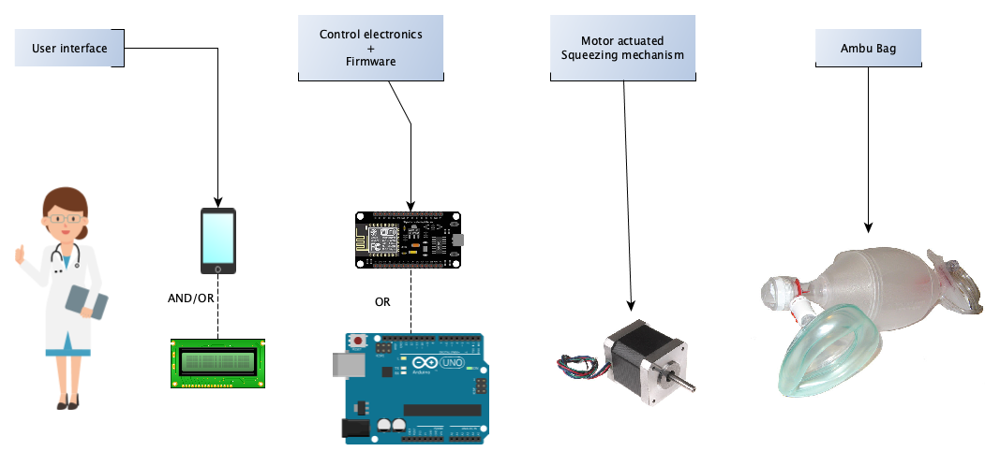
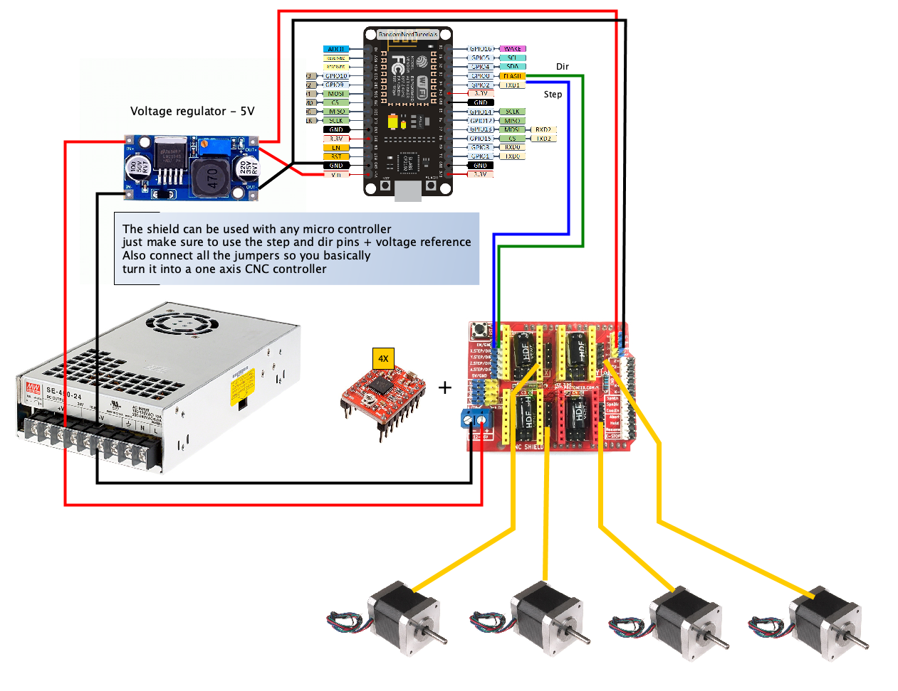

# code-twister ventilator

## The idea

Following the shortages of ventilators in countries severely affected by covid 19 this project aimed to give a relatively cheap solution to help those people who have no other option.

The design itself is intended to be free for anyone to use, update, create and even sell the machines.

There are a lot of other open source ventilators to choose from, hopefully this design will also help.

DISCLAIMER: This project and all related resources are provided without any guaranties, and you should use it at your own risk. Please make sure you respect the law in your country related to medical equipment.

### Things considered
 - Parts should be readily available (e.g. 3d printer parts).
 - Custom components should be 3d printable or created using common hand tools.
 - Use **ambu bag** as air delivery to make sure it's safe for patients.
 - A way to set parameters like speeds, volume, pressure limits, sigh feature.
 - Ambu bag must be easy to replace by medical personnel.

## Ventilator prototype

## Parts 

Purchasable parts:

| Part name             | Count | Comments                       |
|:----------------------|------:|--------------------------------|
| Nema 17 Motor         |      4| bigger motor would work better |
| CNC Shield            |      1| one that has 4 motor drivers   |
| Pololu stepper driver |      4|                                |
| 8mm linear rail       |      2| 260mm                          |
| LM8UU bearing         |      4|                                |
| Wood board            |      1| 600x300mm                      |
| Ambu Bag              |      1|                                |
| M5 threaded rod - L1  |      8| ~ 150mm                        |
| M5 threaded rod - L2  |      2| ~ 120mm                        |
| GT2-20 Pulley         |      2|                                |
| GT2 Timing belt       |      2| ~ 400mm                        |
| 12/24V power supply   |      1| most stepper drivers can handle up to 30V |
| Arduino/NodeMCU       |      1| any microcontroller that has at least 2 digital output pins |
| 625 bearing           |      4|                                |
| M3 screws & nuts      |      ?| mostly 10mm & 15mm, longer ones are also OK |
| Wood screws           |      ?| for: feet, power supply, electronics and fixing the top mechanism to the base |
| Zip ties - 3mm        |      ?| fixing                                | 
| Legs                  |      4| I used furniture legs from hardware store but you can print them |
| Mechanical end-stop   |      1|                                | 

3D Printed parts:

| Part name                   | Count | Link                             |
|:----------------------------|------:|----------------------------------|
| Motor mounting plate 1      |      4| [download](3d_models/MountingPlate1.stl)  |
| Motor mounting plate 2      |      4| [download](3d_models/MountingPlate2.stl)|
| Small Gear                  |      4| [download](3d_models/InputGear.stl)|
| Large Gear                  |      4| [download](3d_models/OutputGear.stl)|
| Small Motor spacer          |     16| [download](3d_models/SmallMotorSpacer.stl)|
| Large Motor spacer          |      3| [download](3d_models/LargeMotorSpacer.stl)|
| Motor Mounting spacer       |      2| [download](3d_models/MotorMountingSpacer.stl)|
| Spacer with end-stop        |      1| [download](3d_models/SpacerWithEndstop.stl)|
| Shaft holder                |      2| [download](3d_models/ShaftHolder.stl)|
| Carriage Upper              |      1| [download](3d_models/CarriageUpper.stl)|
| Carriage Lower              |      1| [download](3d_models/CarriageLower.stl)|
| Arm link                    |      2| [download](3d_models/ArmLink.stl)|
| Pad                         |      2| [download](3d_models/Pad.stl)|
| Bag Holder base             |      2| [download](3d_models/BagHolderBase.stl)|
| Bag Holder slider           |      2| [download](3d_models/BagHolderSlider.stl)|
| Electronics box             |      1| Design or download an electronics box that fits your circuit |

## Example circuit

This is the basic circuit. It's recommended to also add an end-stop and pressure sensors on the air line. These can be directly wired to the microcontroller (no need to use the CNC shield).

## Tips

Although the circuit is using the CNC shield, you don't need to upload a GRBL firmware, just make sure to use a pololu stepper driver with the correct pins configured.

The mechanism relies on the fact that all motors are mechanically connected. This means that all the forces are split equally. The motors and drivers should have the same specs, also you can drive them with only one set of dir and step pins.

To tension the belt: once the top mechanism is completely assembled, screw down one motor assembly and pivot the other one around the shaft holder. This will give you slack to shorten the belts. (Please make sure belts have same length, otherwise the carriages will not meet in the middle)

Don't try to make a very sturdy bag holder. The bag needs to expand and contract when squeezed. If the holder isn't flexible enough, the bag will either pop off, or the force will be added to the air resistance and stall the motors.  

## Limitations and proposed improvements

After lots of calculations, measurements I arrived at the conclusion that practice doesn't always match theory.
While the ~0.5Nm Nema 17 motors seem to just about meet the required torque output, there are some weak elements to this design.
The mounting of the large gear on the drive shaft (5mm threaded rod) and the GT2 pulley sometimes slip. 

Another issue is noise. Fixing the motors directly to the base transfers all the vibrations of the mechanism + the natural noise of the stepper motors.

If you use a pressure sensor make sure to find a working pin on the microcontroller for it first, as it may not work with all input pins.

Proposed solutions:
 * introduce larger motors (different drivers, and probably without the shield)
 * drill hole in the shaft that accepts a set screw (to avoid slipping), maybe use a larger drive shaft
 * place a rubber pad between motor mount and base to reduce vibrations.
 * add stepper silencer boards or use more expensive and efficient motor drivers.
